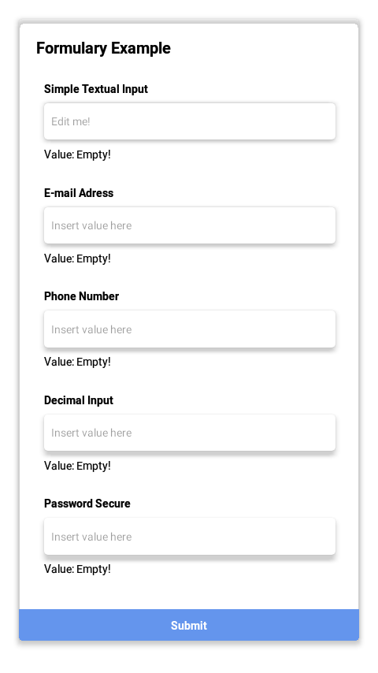
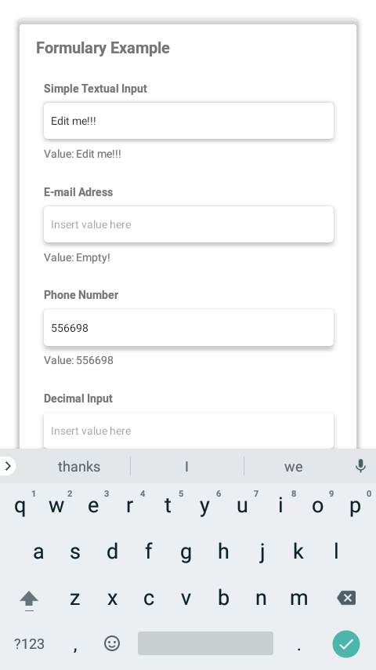
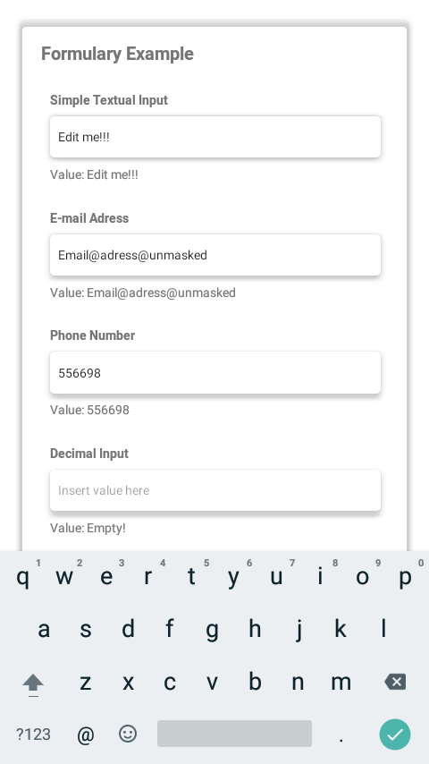
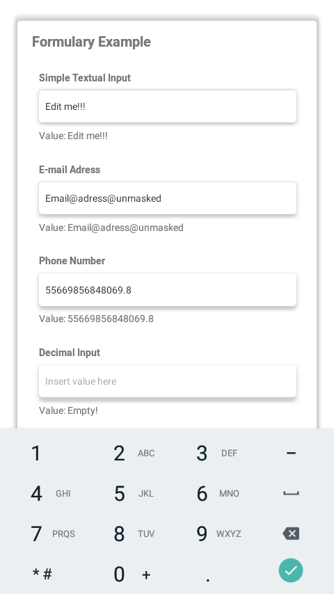
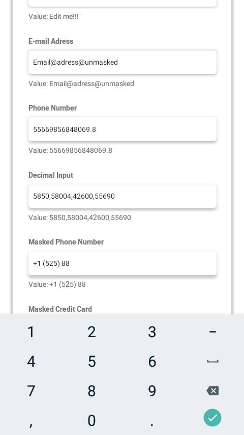
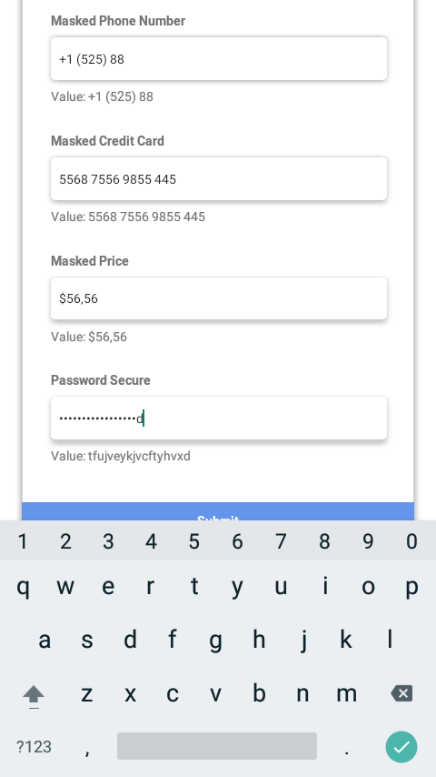
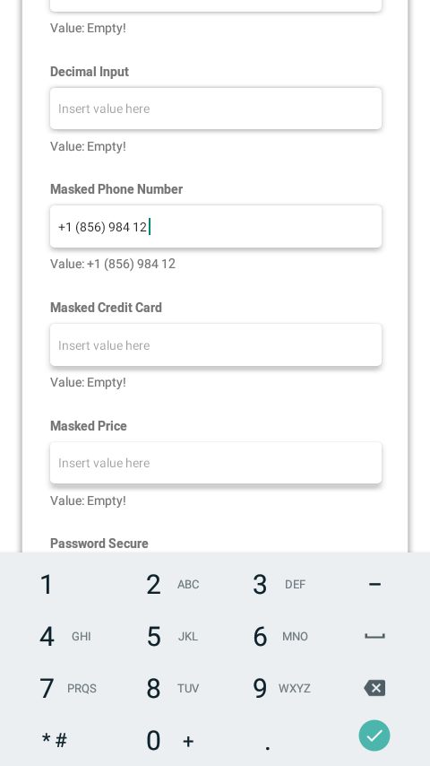
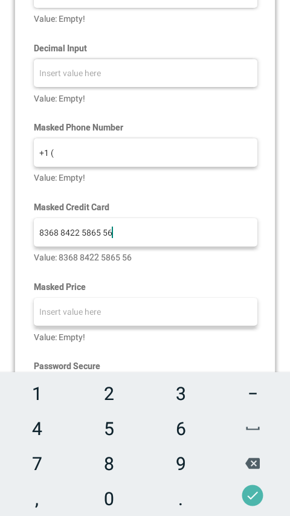
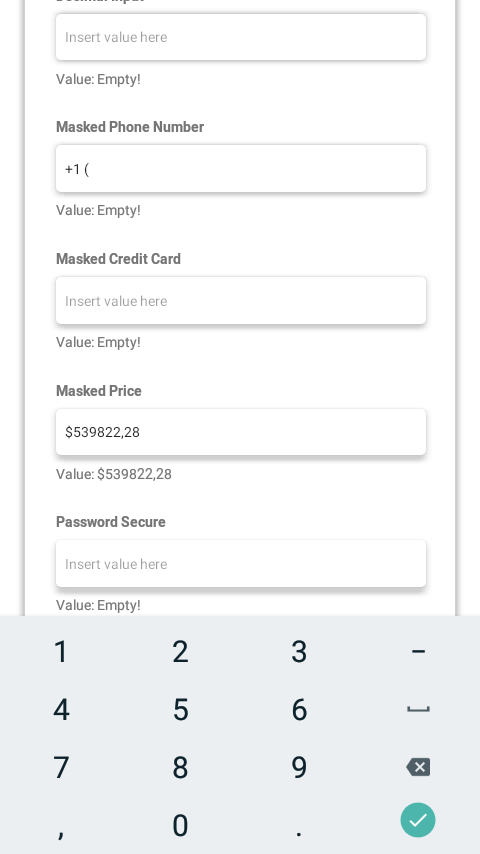

# TextInput in ReactNative

---
## Summary

- [Introduction](#Introduction): a brief explanation about TextInput component
- [Code Overview](#Code-Overview): basic code overview
- [Use Cases](#Use-Cases): textual input, numeric input, passwords
- [Advanced Usage](#Advanced-Usage): controlled input, masks
- [Troubleshooting](#Troubleshooting): flickering, rerendering
- [Source Code](#Source-Code): full example source code
- [References](#References)

---
## Introduction

Directly from the React Native Core Component library this may be one of the most commonly used components out there: the TextInput. This simple component is so fundamental in any application design that there are possibly only a few applications not using it. In this article we are going to cover the commonliest use cases, input masking and basic troubleshooting. If you want to know more about one of the most used components from React Native check this article out!

---
## Code Overview

Although the first examples are basic snippets focusing on TextInput instantiation, our final example covers the Formulary use case and includes further styling and layout of components. Starting off with simple snippets to exemplify TextInput instantiation, this study examines the component in a common Formulary scenario so that we are able to turn a configuration like this:

```js
  const Form = [
    {
      slug: 'textinput1',
      label: 'Simple Textual Input',
      props: {
        placeholder: 'Edit me!'
      }
    },
    {
      slug: 'mailaddress',
      label: 'E-mail Adress',
      props: {
        keyboardType: 'email-address'
      }
    },
    {
      slug: 'phonenumber',
      label: 'Phone Number',
      props: {
        keyboardType: 'phone-pad',
      }
    },
    {
      slug: 'decimalinput',
      label: 'Decimal Input',
      props: {
        keyboardType: 'decimal-pad',
      }
    },
    {
      slug: 'maskedphonenumber',
      label: 'Masked Phone Number',
      props: {
        keyboardType: 'phone-pad',
        mask: "+1 ([000]) [000] [00] [00]"
      }
    },
    {
      slug: 'creditcard',
      label: 'Masked Credit Card',
      props: {
        keyboardType: 'numeric',
        mask: "[0000] [0000] [0000] [0000]"
      }
    },
    {
      slug: 'price',
      label: 'Masked Price',
      props: {
        keyboardType: 'numeric',
        mask: "$[999990],[99]"
      }
    },
    {
      slug: 'secureinput',
      label: 'Password Secure',
      props: {
        secureTextEntry: true
      }
    },
  ]
```

Into a formulary like this:



To achive this Formulary with styled layout we are using the library [6] `styled-components` and implementing a basic component layout structure with a simple logic to render an array of fields in that formulary. You can check out the full source code at the [end of the article](#Source-Code)!

---
## Use Cases

This section aims at exploring the basic use cases for TextInput that require minimal configuration such as keyboard layout.

### Textual Input

Perhaps this is the simplest and commonliest use case for TextInput. In many cases the pure textual input is what most developers are looking for when implementing a basic formulary layout for a scene, before entering the complex part of the job for that scene. This use case doesn't require further configuration and is implemented as shown in the example below:

```js
import React, { useState } from 'react';
import { Text, TextInput, View } from 'react-native';

export default function Application() {
  const [text, setText] = useState('');
  return (
    <View>
      <TextInput
        onChangeText={text => setText(text)}
        defaultValue={text}
      />
      <Text>
        {text}
      </Text>
    </View>
  );
}
```


### Mail adress and URL input

Although the simple pure textual input may fit for many basic use cases in the majority of scenarios there may be a need for some different kind of textual inputs such as url or email, such as in scenarios where the user is required to input login credentials or registration formularies and such.

The implementation of the TextInput component for this use case require a simple configuration of the `keyboardType` property to use the `email-address` value (which is a cross-platform option) or the platform specific `url, twitter, web-search` (valid only for iOS), while there are no android specific values for this same feature:

```js
  <TextInput
    keyboardType="email-address"
    onChangeText={setText}
    defaultValue={text}
  />
```


### Phone number input

There may be also some requirement to implement a use case which enables the user to insert phone numbers in some different kind of scenarios. To achieve this feature the TextInput must be configured with the `keyboardType` property defined to `phone-pad` (which is a cross-platform option that will work in both Android and iOS) or `name-phone-pad` which is iOS specific option:

```js
  <TextInput
    keyboardType="phone-pad"
    onChangeText={setText}
    defaultValue={text}
  />
```


### Weights, quantities input

For even different scenarios where the user may need to directly insert values such as weights, distances and quantities (which are common in e-commerce type of applications) the developer may need to configure the TextInput keyboard for decimal values input.

This feature may cover different use cases as there are different types of numeric input such as weight, distance or quantities inputs. The TextInput must be configured with the `keyboardType` property defined to one of the `decimal-pad, numeric` cross-platform values or `numbers-and-punctuation` iOS specific values:

```js
  <TextInput
    keyboardType="decimal-pad"
    onChangeText={setText}
    defaultValue={text}
  />
```


### Passwords

This use case refers to the most common case of secure textual input seen across any Sign Up/Sign In formulary in the general applications. When implementing this kind of scenario the developer may need to implement a secure TextInput which will hide it's content while the user interacts with the component.

To enable the hidden content TextInput the developer must enable the property `secureTextEntry` on the TextInput component. In some cases the developer is required to implement the feature accompained by some way to toggle between secure and unsecure text as shown in the example:

```js
import React, { useState } from 'react';
import { Button, Text, TextInput, View } from 'react-native';

export default function Application() {
  const [text, setText] = useState('');
  const [enableSecure, setEnableSecure] = useState(true);
  function toggleSecure() {
    setEnableSecure(value => !value)
  }
  return (
    <View>
      <TextInput
        secureTextEntry={enableSecure}
        onChangeText={text => setText(text)}
        defaultValue={text}
      />
      <Text>
        {text}
      </Text>
      <Button onPress={toggleSecure}>
        Toggle secure text
      </Button>
    </View>
  );
}
```


---
## Advanced Usage

### Controlled input

Now that we know how to instance a basic version of TextInput with custom keyboard configuration it may be interesting to get to know how to control that input so that we're able to modify TextInput content as the user types. For that we need to change somethings on our first example but basically changing the `defaultValue` property to `value` prop and applying some text processing on the text setter:

```js
import React, { useState } from 'react';
import { Text, TextInput, View } from 'react-native';

const Application = () => {
  const [text, setText] = useState('');
  function onChangeText(text) {
    setText(text.replaceAll(/[0-9]/g,'X'))
  }
  return (
    <View>
      <TextInput
        onChangeText={onChangeText}
        value={text}
      />
      <Text>
        {text}
      </Text>
    </View>
  );
}

export default Application;
```

In this example the TextInput setter processing is made in such a way that all numbers are replaced by the character X. This is the basic method used by many TextInput masks technologies out there. However the third party libraries that implement masking will save you precious time and are the recommended way to implement masking in any serious application. If you're looking into masking TextInput check out the next section!

### Masks

TextInput masks are an easy to achieve feature when using third-party libraries such as [react-native-text-input-mask](https://github.com/react-native-text-input-mask/react-native-text-input-mask) which are able to resolve the mask feature quite easily for the developer. To achieve TextInput masking with this library the developer may setup a simple mask string which describes the desired text format in the mask. The most basic way to use is in the example as follows:

```js
import TextInputMask from 'react-native-text-input-mask';

<TextInputMask
  mask={"+1 ([000]) [000] [00] [00]"}
  onChangeText={(formatted, extracted) => console.log(formatted, extracted)}
/>
```

The mask used in the example above is commonly used for phone inputs but there are many more:

Type|Mask
-|-
Phone Number|"+1 ([000]) [000] [00] [00]"
Credit Card|"[0000] [0000] [0000] [0000]"
Price|"$[999990],[99]"

  

---
## Troubleshooting

### Flickering

The flickering bug may occur mainly when using controlled TextInput (the type of component that receives the prop `value` directly) and mishandling the user input in some way, such as in cases where user input does not affect the input value. From the React Native Dev pages [2]:

> [Value prop](https://reactnative.dev/docs/textinput#value): [...] For most uses, this works great, but in some cases this may cause flickering - one common cause is preventing edits by keeping value the same. In addition to setting the same value, either set editable={false}, or set/update maxLength to prevent unwanted edits without flicker.

> [maxLength prop](https://reactnative.dev/docs/textinput#maxlength): Limits the maximum number of characters that can be entered. Use this instead of implementing the logic in JS to avoid flicker.

To resolve flickering problems the developer must pay attention to these lines on the documentation and try to debug whether the input value setters are messing with the component internal value state.

### Rerendering

Sometimes when using a controlled state TextInput the developer may perceive that the components around the input are rerendering and this may be caused by undesired value setters in the component structure. To resolve this problem try to debug the setters and test whether the use of `useMemo` or `useCallback` may resolve your issue.

---
## Source Code

```js
import React from 'react';
import * as Native from 'react-native';
import styled from 'styled-components'
import TextInputMask from 'react-native-text-input-mask'

const Layout = {
  Container: styled.View`
    align-items: center;
    justify-content: center;
    padding: 5%;
    height: 100%;
    width: 100%;
  `,
  Card: styled.View`
    elevation: 5;
    width: 100%;
    border-radius: 5px;
    overflow: hidden;
  `
}

const Formulary = {
  Container: styled.View`
    padding: 5%;
  `,
  Field: styled.View`
    background-color: white;
    border-radius: 5px;
    padding: 2.5%;
  `,
  Title: styled.Text`
    font-weight: bold;
    font-size: 20px;
    padding-bottom: 5%;
  `,
  Label: styled.Text`
    font-weight: bold;
    padding-bottom: 2.5%;
  `,
  Value: styled.Text`
    padding-top: 2.5%;
    padding-bottom: 2.5%;
  `,
  TextInput: styled.TextInput`
    background-color: white;
    elevation: 5;
    border-radius: 5px;
    padding: 2.5%;
  `,
  TextInputMask: styled(TextInputMask)`
    background-color: white;
    elevation: 5;
    border-radius: 5px;
    padding: 2.5%;
  `
}

const Button = {
  Container: styled.TouchableOpacity`
    background-color: cornflowerblue;
    width: 100%;
    padding: 2.5%;
    align-items: center;
    justify-content: center;
  `,
  Label: styled.Text`
    color: white;
    font-weight: bold;
  `,
}

export default function Application() {
  const [values, setValues] = React.useState({})
  function onChange(field) {
    return function onChangeField(value) {
      setValues(actualValues => ({
        ...actualValues,
        [field.slug]: value
      }))
    }
  }
  function RenderField(field) {
    const Input = field.props && field.props.mask !== undefined
      ? Formulary.TextInputMask
      : Formulary.TextInput
    return (
      <Formulary.Field key={field.slug}>
        <Formulary.Label>
          {field.label}
        </Formulary.Label>
        <Input
          onChangeText={onChange(field)}
          defaultValue={values[field.slug]}
          placeholder="Insert value here"
          {...field.props}
        />
        <Formulary.Value>
          Value: {values[field.slug] || 'Empty!'}
        </Formulary.Value>
      </Formulary.Field>
    )
  }
  const Form = [
    {
      slug: 'textinput1',
      label: 'Simple Textual Input',
      props: {
        placeholder: 'Edit me!'
      }
    },
    {
      slug: 'mailaddress',
      label: 'E-mail Adress',
      props: {
        keyboardType: 'email-address'
      }
    },
    {
      slug: 'phonenumber',
      label: 'Phone Number',
      props: {
        keyboardType: 'phone-pad',
      }
    },
    {
      slug: 'decimalinput',
      label: 'Decimal Input',
      props: {
        keyboardType: 'decimal-pad',
      }
    },
    {
      slug: 'maskedphonenumber',
      label: 'Masked Phone Number',
      props: {
        keyboardType: 'phone-pad',
        mask: "+1 ([000]) [000] [00] [00]"
      }
    },
    {
      slug: 'creditcard',
      label: 'Masked Credit Card',
      props: {
        keyboardType: 'numeric',
        mask: "[0000] [0000] [0000] [0000]"
      }
    },
    {
      slug: 'price',
      label: 'Masked Price',
      props: {
        keyboardType: 'numeric',
        mask: "$[999990],[99]"
      }
    },
    {
      slug: 'secureinput',
      label: 'Password Secure',
      props: {
        secureTextEntry: true
      }
    },
  ]
  return (
    <Native.KeyboardAvoidingView behavior="padding">
      <Native.StatusBar hidden />
      <Native.ScrollView>
        <Layout.Container>
          <Layout.Card>
            <Formulary.Container>
              <Formulary.Title>
                Formulary Example
              </Formulary.Title>
              {Form.map(RenderField)}
            </Formulary.Container>
            <Button.Container>
              <Button.Label>
                Submit
              </Button.Label>
            </Button.Container>
          </Layout.Card>
        </Layout.Container>
      </Native.ScrollView>
    </Native.KeyboardAvoidingView>
  );
}
```

---
## References

Below are all reference documentation used to produce this article:

1. https://callstack.github.io/react-native-paper/text-input.html

2. https://reactnative.dev/docs/textinput

3. https://reactnative.dev/docs/handling-text-input

4. https://lefkowitz.me/visual-guide-to-react-native-textinput-keyboardtype-options/

5. https://github.com/react-native-text-input-mask/react-native-text-input-mask

6. https://www.npmjs.com/package/styled-components

---
## Attributions

<a href='https://br.freepik.com/fotos/maquete'>Mock smartphone image created by wayhomestudio - br.freepik.com</a>